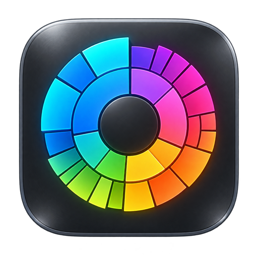

# Disk Map per macOS

[English](../README.md) · [Русский](README.ru.md) · [Deutsch](README.de.md) · [Français](README.fr.md) · [Español](README.es.md) · **Italiano** · [Português](README.pt.md) · [Polski](README.pl.md) · [Türkçe](README.tr.md) · [简体中文](README.zh-Hans.md) · [繁體中文](README.zh-Hant.md) · [日本語](README.ja.md) · [한국어](README.ko.md)
[**⬇️ Scarica Disk Map 1.9 per macOS**](https://github.com/homecrafter/disk-map-macos/releases/download/v1.9/Disk-Map-1.9-macOS.dmg)

**Disk Map** è un’app nativa e gratuita per macOS che mostra chiaramente cosa occupa spazio sul Mac.

Sviluppatore: **Andrey Minenkov**. Versione attuale: **1.9 (build 12)**.

## Funzioni

- analisi di cartelle, dischi, cartelle utente e unità esterne;
- mappa radiale interattiva dello spazio occupato;
- anteprima dei file con Quick Look premendo la barra spaziatrice;
- visualizzazione nel Finder, spostamento nel Cestino e pulizia di più elementi;
- scansione normale o approfondita con avanzamento in tempo reale;
- visualizzazione dello spazio libero, nascosto e liberabile;
- formattazione sicura di unità esterne in exFAT, APFS o FAT32;
- interfaccia in 13 lingue;
- nessuna registrazione, pubblicità, analisi d’uso o connessione di rete.

L’analisi avviene interamente sul Mac. Le informazioni sui file non vengono trasmesse.

## Download e installazione

Apri **Releases** e scarica `Disk-Map-1.9-macOS.dmg`. Sono richiesti macOS 13 o versioni successive; sono supportati Mac Apple Silicon e Intel.

Apri il DMG e trascina l’app nella cartella Applicazioni. L’app non è ancora autenticata da Apple. Se macOS blocca il primo avvio, apri **Impostazioni di Sistema → Privacy e sicurezza**, fai clic su **Apri comunque** e conferma. [Istruzioni Apple](https://support.apple.com/102445).

L’accesso completo al disco serve solo per la scansione approfondita delle cartelle protette.

SHA-256: `9c1dc8443ab0cea84a715cd27bcf85e60cd6eaee397936af2794f612c2443933`

L’app è gratuita. Il codice sorgente non è pubblicato in questo repository.

© 2026 Andrey Minenkov
