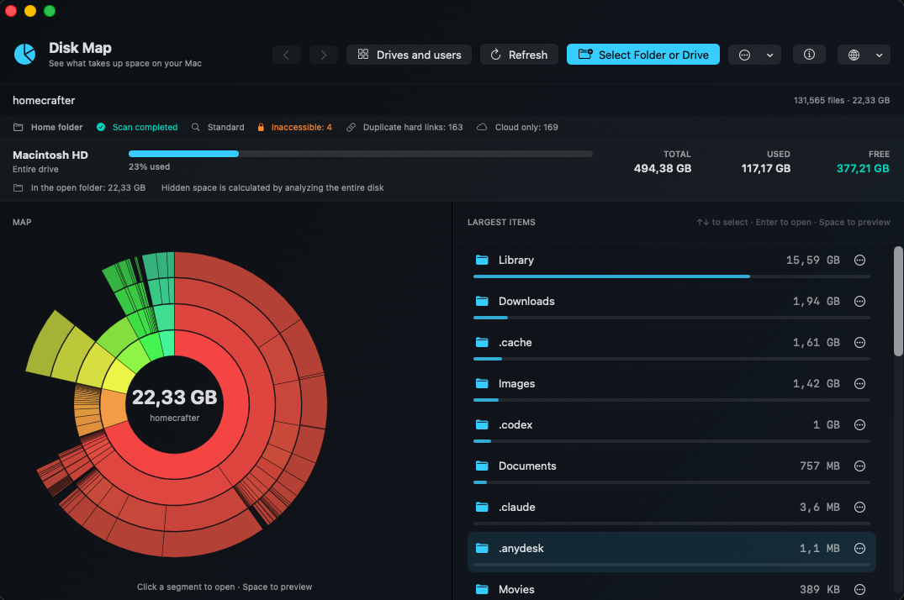

# Карта диска для macOS

[English](../README.md) · **Русский** · [Deutsch](README.de.md) · [Français](README.fr.md) · [Español](README.es.md) · [Italiano](README.it.md) · [Português](README.pt.md) · [Polski](README.pl.md) · [Türkçe](README.tr.md) · [简体中文](README.zh-Hans.md) · [繁體中文](README.zh-Hant.md) · [日本語](README.ja.md) · [한국어](README.ko.md)

[**⬇️ Скачать Disk Map 1.10 для macOS**](https://github.com/homecrafter/disk-map-macos/releases/download/v1.10/Disk-Map-1.10-macOS.dmg)

[💬 Отзывы и вопросы](https://github.com/homecrafter/disk-map-macos/discussions/new?category=general) · [🐞 Сообщить об ошибке](https://github.com/homecrafter/disk-map-macos/issues/new?template=bug_report.yml)

**Карта диска** — бесплатное нативное приложение для macOS, которое наглядно показывает, чем занято место на Mac.

Разработчик: **Андрей Миненков**. Текущая версия: **1.10 (сборка 13)**.

## Скриншоты

  
  

## Возможности

- анализ папок, дисков, домашних каталогов пользователей и внешних накопителей;
- интерактивная круговая карта и список крупнейших объектов;
- навигация по папкам и просмотр файлов через Quick Look клавишей `Пробел`;
- показ в Finder, перемещение в Корзину и подготовка нескольких объектов к очистке;
- обычное и глубокое сканирование с отображением прогресса;
- отображение свободного, скрытого и очищаемого места;
- безопасное форматирование внешних накопителей в exFAT, APFS или FAT32;
- 13 языков интерфейса;
- работа без регистрации, рекламы, аналитики и сетевых подключений.

Весь анализ выполняется локально. Сведения о файлах никуда не отправляются.

## Загрузка и установка

Откройте раздел **Releases** и скачайте `Disk-Map-1.10-macOS.dmg`. Требуется macOS 13 или новее; поддерживаются Mac с Apple Silicon и Intel.

Откройте DMG и перетащите приложение в папку «Программы». Приложение пока не нотарифицировано Apple. Если macOS заблокирует первый запуск, откройте **Системные настройки → Конфиденциальность и безопасность**, нажмите **Всё равно открыть** и подтвердите запуск. [Инструкция Apple](https://support.apple.com/102445).

Полный доступ к диску нужен только для глубокого анализа защищённых каталогов.

SHA-256: `12810677250d21687b527b5fdd10abf49fc27356d8b41078de5448bba70e7e90`

Приложение бесплатно. Исходный код в этом репозитории не публикуется.

© 2026 Андрей Миненков
