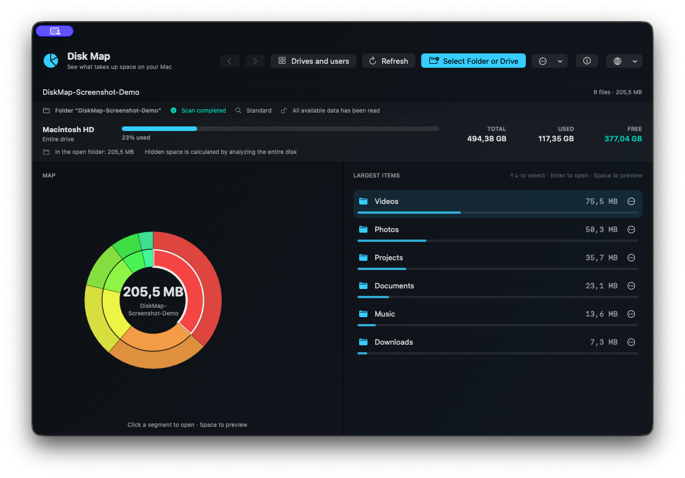
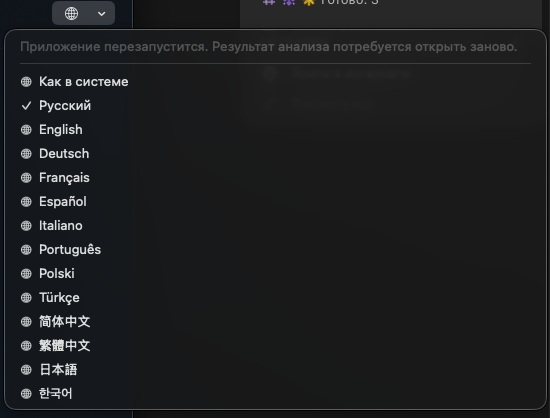
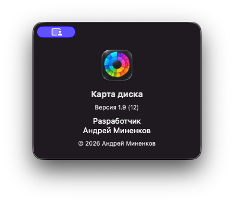

# macOS için Disk Map

[English](../README.md) · [Русский](README.ru.md) · [Deutsch](README.de.md) · [Français](README.fr.md) · [Español](README.es.md) · [Italiano](README.it.md) · [Português](README.pt.md) · [Polski](README.pl.md) · **Türkçe** · [简体中文](README.zh-Hans.md) · [繁體中文](README.zh-Hant.md) · [日本語](README.ja.md) · [한국어](README.ko.md)

[**⬇️ macOS için Disk Map 1.9’u indir**](https://github.com/homecrafter/disk-map-macos/releases/download/v1.9/Disk-Map-1.9-macOS.dmg)

[💬 Geri bildirim ve sorular](https://github.com/homecrafter/disk-map-macos/discussions/new?category=general) · [🐞 Hata bildir](https://github.com/homecrafter/disk-map-macos/issues/new?template=bug_report.yml)

**Disk Map**, Mac’inizde hangi dosyaların yer kapladığını açıkça gösteren ücretsiz ve yerel bir macOS uygulamasıdır.

Geliştirici: **Andrey Minenkov**. Güncel sürüm: **1.9 (derleme 12)**.

## Ekran görüntüleri

  
  

## Özellikler

- klasörleri, diskleri, kullanıcı klasörlerini ve harici sürücüleri tarama;
- etkileşimli radyal haritayla depolama alanını inceleme;
- boşluk tuşuyla Quick Look önizlemesi;
- öğeleri Finder’da gösterme, Çöp Sepeti’ne taşıma ve toplu temizlik;
- canlı ilerleme göstergeli normal veya derin tarama;
- boş, gizli ve temizlenebilir alanı görüntüleme;
- harici sürücüleri güvenlik kontrolleriyle exFAT, APFS veya FAT32 olarak biçimlendirme;
- 13 arayüz dili;
- kayıt, reklam, kullanım analizi ve ağ bağlantısı olmadan çalışma.

Tüm analiz Mac’inizde yerel olarak yapılır. Dosya bilgileri hiçbir yere gönderilmez.

## İndirme ve kurulum

**Releases** bölümünü açın ve `Disk-Map-1.9-macOS.dmg` dosyasını indirin. macOS 13 veya daha yenisi gerekir; Apple Silicon ve Intel Mac’ler desteklenir.

DMG dosyasını açıp uygulamayı Uygulamalar klasörüne sürükleyin. Uygulama henüz Apple tarafından noter onayından geçirilmemiştir. macOS ilk açılışı engellerse **Sistem Ayarları → Gizlilik ve Güvenlik** bölümünü açın, **Yine de Aç** düğmesine basın ve onaylayın. [Apple yönergeleri](https://support.apple.com/102445).

Tam Disk Erişimi yalnızca korunan klasörlerin derin taraması için gereklidir.

SHA-256: `9c1dc8443ab0cea84a715cd27bcf85e60cd6eaee397936af2794f612c2443933`

Uygulama ücretsizdir. Kaynak kodu bu depoda yayımlanmaz.

© 2026 Andrey Minenkov
